# ZiggyAI System Architecture

This document provides detailed architecture diagrams for the ZiggyAI trading platform using Mermaid notation.

---

## Table of Contents

- [High-Level Architecture](#high-level-architecture)
- [Backend Architecture](#backend-architecture)
- [Frontend Architecture](#frontend-architecture)
- [Data Flow](#data-flow)
- [Trading System](#trading-system)
- [Machine Learning Pipeline](#machine-learning-pipeline)
- [Database Schema](#database-schema)
- [Deployment Architecture](#deployment-architecture)

---

## High-Level Architecture

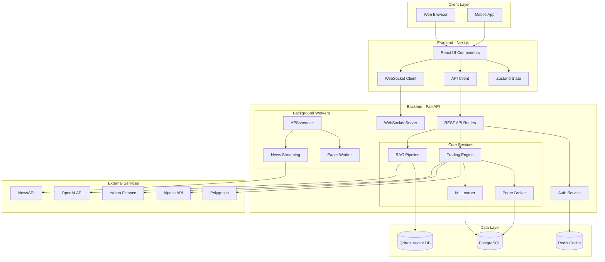

---

## Backend Architecture

### API Router Structure

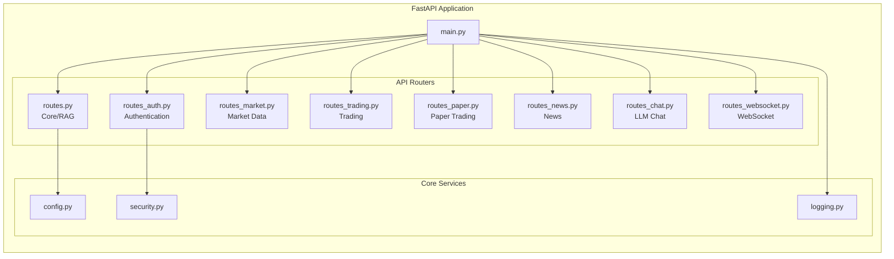

### Service Layer

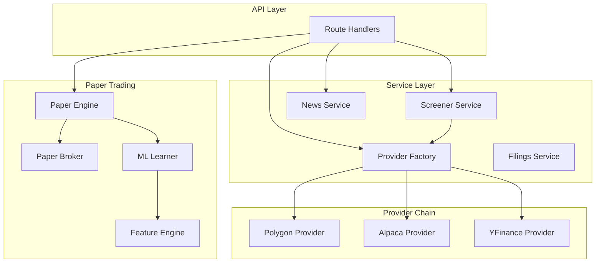

---

## Frontend Architecture

### Component Hierarchy

```mermaid
graph TB
    subgraph "Next.js App Router"
        LAYOUT[layout.tsx]
        
        subgraph "Pages"
            HOME[/ Dashboard]
            MARKET_P[/market]
            TRADING_P[/trading]
            PORTFOLIO[/portfolio]
            PAPER_P[/paper-trading]
            NEWS_P[/news]
            CHAT_P[/chat]
        end
    end

    subgraph "Components"
        DASHBOARD[AdvancedDashboard]
        CHARTS[Chart Components]
        CARDS[Ticker Cards]
        SIDEBAR[Sidebar]
        MODALS[Modal Components]
    end

    subgraph "Services"
        API_SVC[API Service]
        AUTH_SVC[Auth Service]
        WS_SVC[WebSocket Service]
    end

    subgraph "State"
        ZUSTAND[Zustand Stores]
        QUERY[React Query]
    end

    LAYOUT --> HOME
    LAYOUT --> MARKET_P
    LAYOUT --> TRADING_P
    
    HOME --> DASHBOARD
    DASHBOARD --> CHARTS
    DASHBOARD --> CARDS
    
    CARDS --> API_SVC
    CHARTS --> WS_SVC
    
    API_SVC --> ZUSTAND
    WS_SVC --> QUERY
```

### State Management

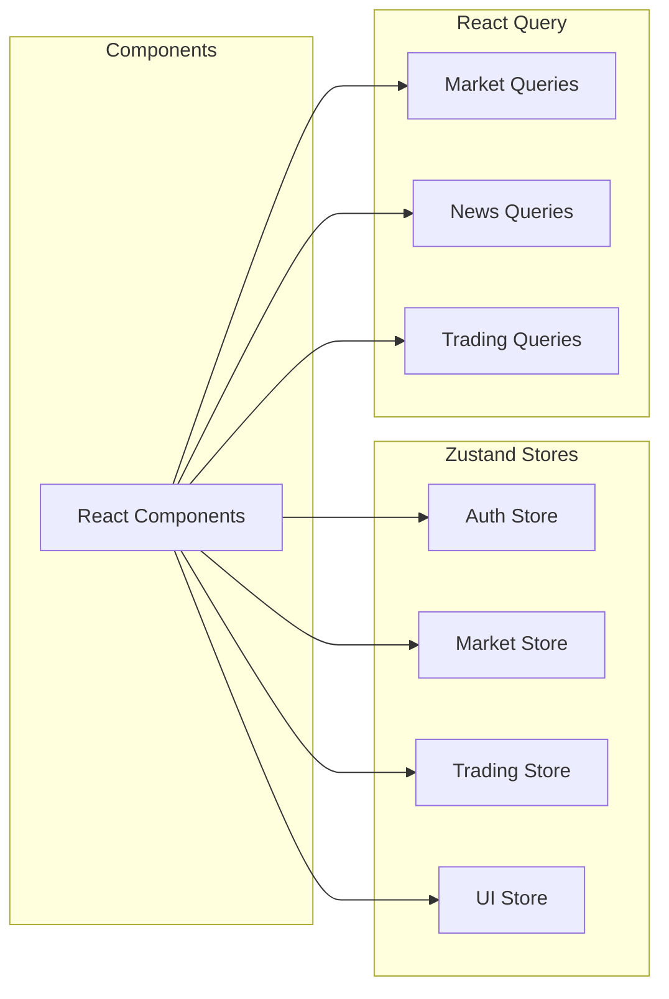

---

## Data Flow

### Trading Signal Flow

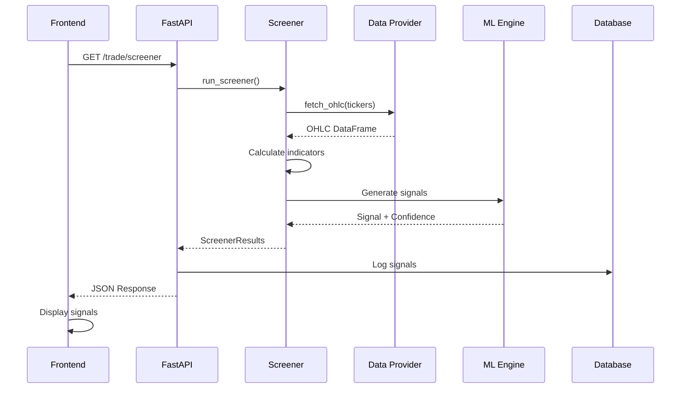

### Paper Trade Execution

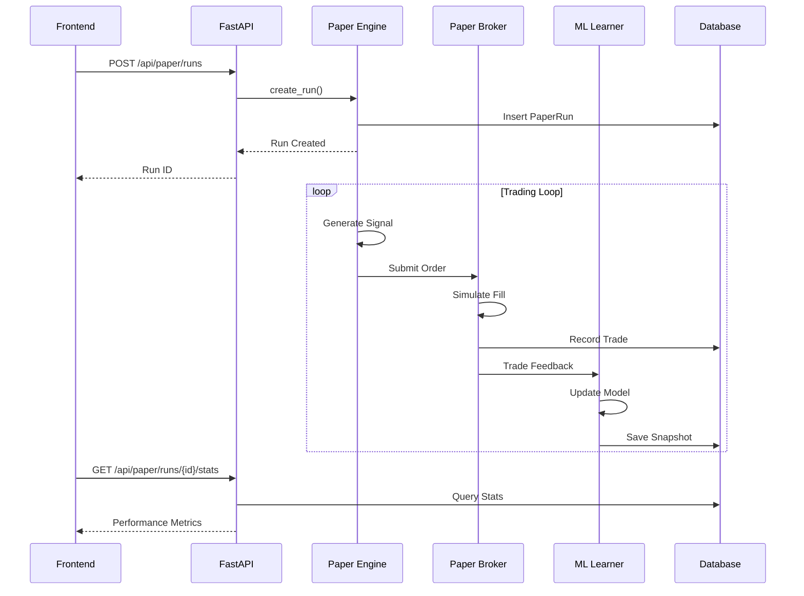

### WebSocket Data Flow

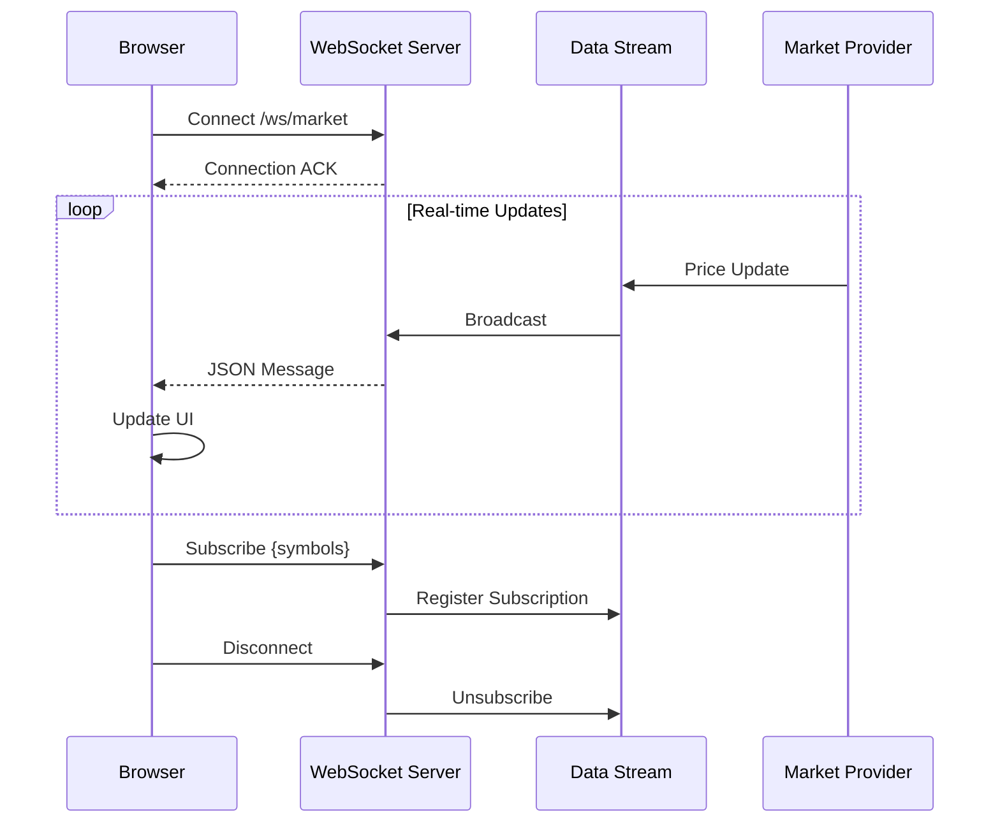

---

## Trading System

### Paper Trading Architecture

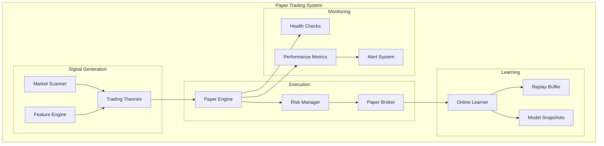

### Order Lifecycle

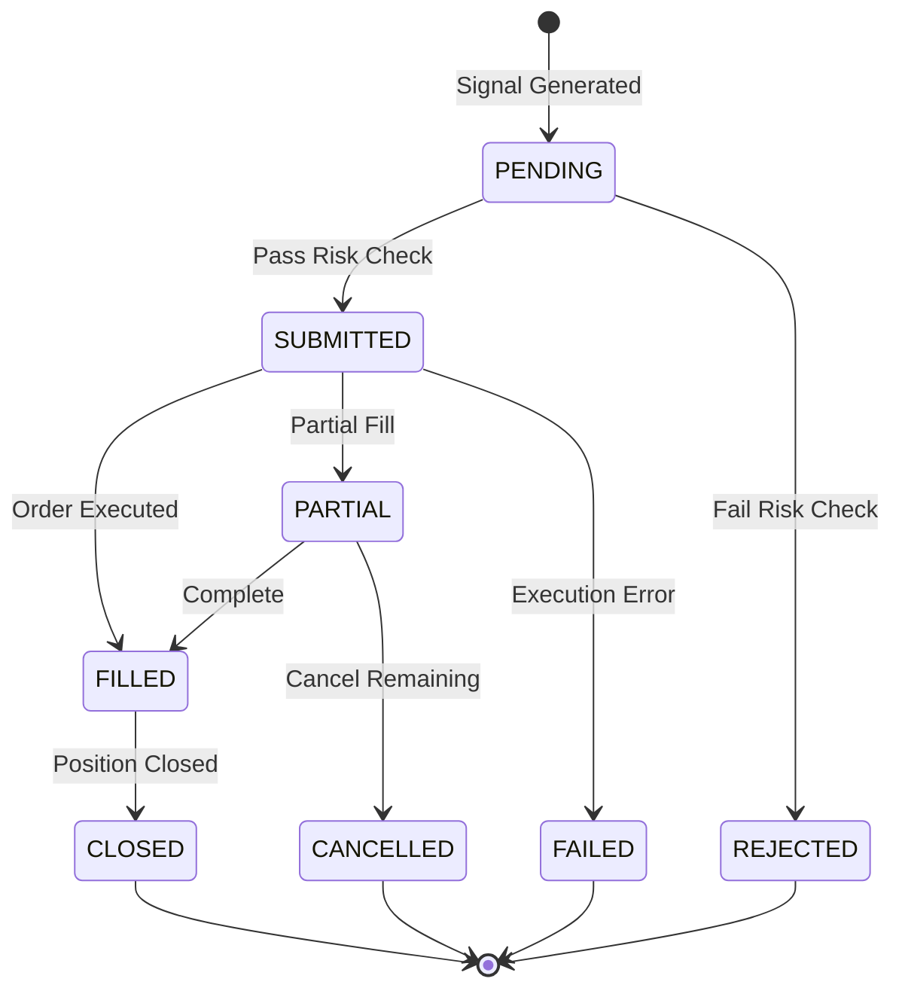

---

## Machine Learning Pipeline

### Online Learning System

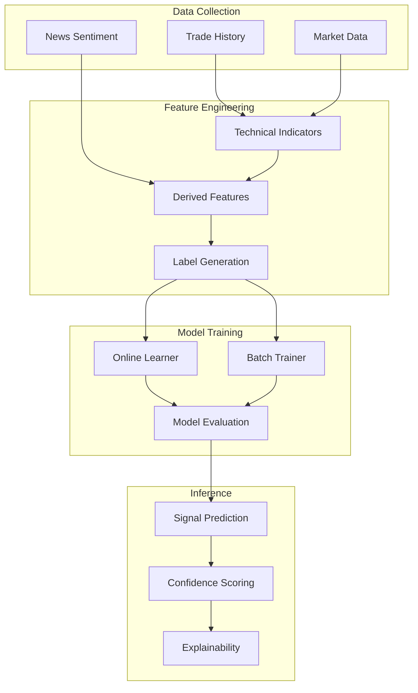

### RAG Pipeline

```mermaid
graph LR
    subgraph "Ingestion"
        PDF[PDF Documents]
        WEB[Web Content]
        RSS[RSS Feeds]
    end

    subgraph "Processing"
        CHUNK[Chunking]
        EMBED[Embedding]
        INDEX[Indexing]
    end

    subgraph "Storage"
        QDRANT[Qdrant Vector DB]
    end

    subgraph "Retrieval"
        QUERY[Query Processing]
        SEARCH[Semantic Search]
        CONTEXT[Context Assembly]
    end

    subgraph "Generation"
        LLM[LLM (OpenAI/Local)]
        RESPONSE[Response Generation]
    end

    PDF --> CHUNK
    WEB --> CHUNK
    RSS --> CHUNK
    
    CHUNK --> EMBED
    EMBED --> INDEX
    INDEX --> QDRANT
    
    QUERY --> SEARCH
    SEARCH --> QDRANT
    QDRANT --> CONTEXT
    
    CONTEXT --> LLM
    LLM --> RESPONSE
```

---

## Database Schema

### Entity Relationship Diagram

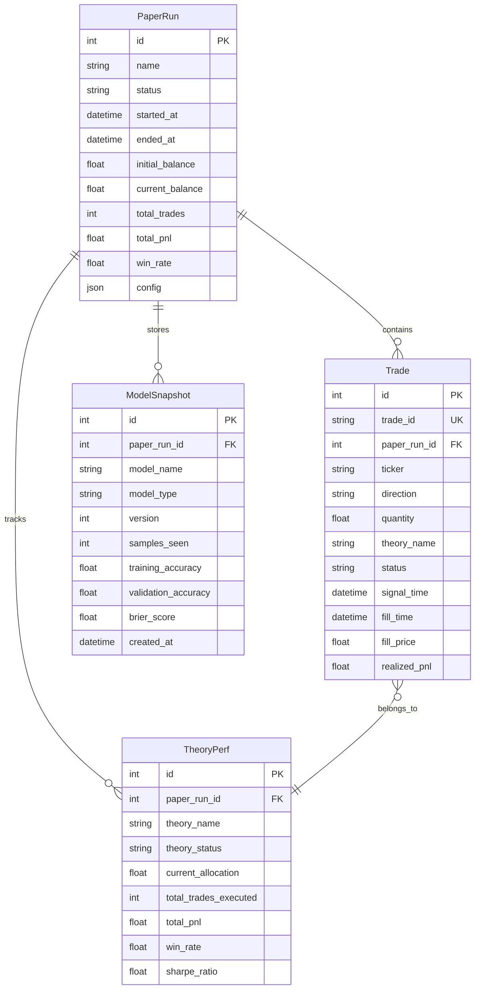

---

## Deployment Architecture

### Docker Compose Stack

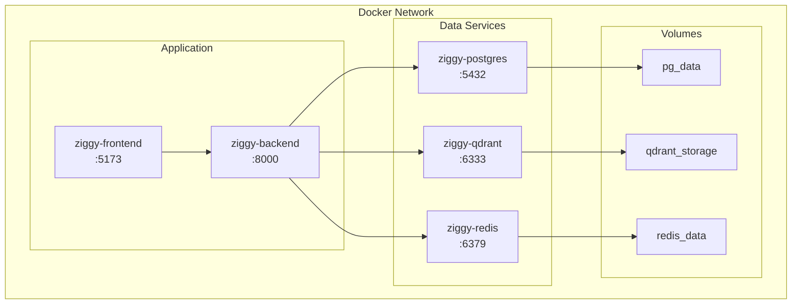

### Production Deployment

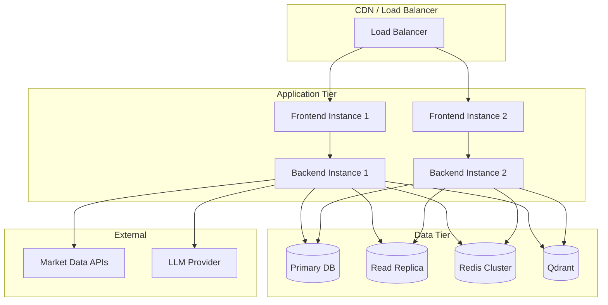

---

## Security Architecture

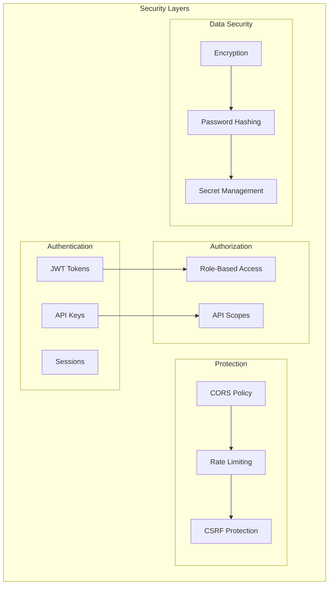

---

## Additional Resources

- [API Documentation](API.md)
- [Setup Guide](SetupGuide.md)
- [Deployment Guide](Deployment.md)
- [Full System Write-up](architecture/ZiggyAI_FULL_WRITEUP.md)
