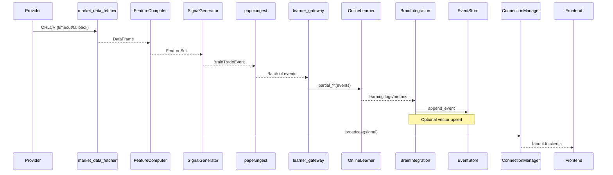

# Ziggy Brain Review and Improvement Plan

Last updated: 2025-11-03

## Executive summary

Ziggy’s "brain" spans feature computation, rule-based signals, regime detection, durable memory, vector recall, streaming/broadcast, and an online-learning paper lab. The system shows solid resilience patterns (bounded WS queues, timeouts, backoff, provider health, OFF-safe defaults), but consistency and observability vary between modules. This plan inventories the brain, maps key dataflows, summarizes behavior, flags risks, and proposes targeted fixes with patch locations and acceptance checks.

Highlights:

- Strengths: Async WS backbone with pruning and heartbeats; timeout/fallback data fetcher; defensive feature computation; append-only durable event log; provider health and failover; paper lab scaffolding.
- Gaps: Mixed retry/backoff policies; some blocking CPU/IO paths in event loops; partial backpressure at producers; vector memory uses placeholder embeddings; learner gateway mostly stubbed; uneven metrics and correlation IDs.
- Priority fixes: unify backoff/retry budget; make WS queue sizes and drops observable; isolate CPU/IO hotspots; wire learner gateway safely; strengthen event-store performance; add minimal real embeddings plug and SLOs.

## Brain map (inventory)

| Path                                                       | Role                                                             | Key classes/functions                                | Inputs                                        | Outputs                       | Storage used         | Notes                                                 |
| ---------------------------------------------------------- | ---------------------------------------------------------------- | ---------------------------------------------------- | --------------------------------------------- | ----------------------------- | -------------------- | ----------------------------------------------------- |
| `backend/app/core/websocket.py`                            | WS connection mgmt, channel queues, broadcaster, market streamer | `ConnectionManager`, `MarketDataStreamer`            | Per-channel messages, market data, heartbeats | Fanout to clients, metrics    | In-memory queues     | Bounded queues, pruning, heartbeats, metrics counters |
| `backend/app/main.py`                                      | FastAPI app wiring, routes, background tasks                     | App factory, startup/shutdown handlers               | Settings, services                            | HTTP/WS endpoints             | —                    | Starts streamers, health endpoints, safety middleware |
| `backend/app/services/market_brain/features.py`            | Compute features with TTL cache                                  | `FeatureComputer`, `FeatureSet`                      | OHLCV (via `market_data_fetcher`)             | Dict/dataclass features       | In-memory caches     | Defensive conversions; optional breadth/VIX           |
| `backend/app/services/market_brain/signals.py`             | Generate rule-based signals                                      | `SignalGenerator`, `Signal`                          | Features + regime                             | Signal with confidence/levels | —                    | ATR-based stops/targets; regime gating                |
| `backend/app/services/market_brain/market_data_fetcher.py` | Timeout/fallback OHLCV + quotes                                  | `get_recent_ohlcv`, `get_realtime_quote`             | Providers (yfinance primary), timeouts        | DataFrames/quotes             | In-memory cache      | ThreadPool + per-provider timeouts, failures map      |
| `backend/app/services/market_brain/regime.py`              | Regime labeling and confidence                                   | `label_regime`, helpers                              | Price/breadth series                          | Regime label + score          | —                    | Simple heuristic regimes                              |
| `backend/app/services/market_brain/simple_data_hub.py`     | Lightweight enhancement facade                                   | `SimpleDataHub`                                      | Market/news data                              | Enriched summaries            | —                    | Overview/breadth/risk/calendar                        |
| `backend/app/services/news_streaming.py`                   | Async news streaming + WS                                        | `NewsStreamer`                                       | RSS/default news providers                    | Broadcast news updates        | —                    | Dedup IDs; enhancement hook                           |
| `backend/app/services/chart_streaming.py`                  | Chart streaming + indicators                                     | `ChartStreamer`                                      | Symbol/timeframe                              | Candle updates                | —                    | Per-symbol tasks; TA indicators                       |
| `backend/app/services/portfolio_streaming.py`              | Portfolio streaming                                              | `PortfolioStreamer`                                  | Positions/balances source                     | Portfolio updates             | —                    | Change detection; backoff                             |
| `backend/app/services/provider_health.py`                  | Provider health + failover                                       | `HealthTracker`, `ProviderHealthManager`             | Provider call outcomes/latency                | Health scores/orderings       | —                    | Decay, latency penalties, contract checks             |
| `backend/app/services/brain_integration.py`                | Write-through to memory                                          | Async batch writer                                   | Events (decisions/NLP/etc.)                   | Durable memory updates        | JSONL/SQLite, vec db | Enrichment, priority; OFF-safe                        |
| `backend/app/services/integration_hub.py`                  | Orchestration/glue                                               | `IntegrationHub`, `IntegratedDecision`               | Signals, memory, health                       | Combined decision struct      | —                    | Central hub; health aggregation                       |
| `backend/app/memory/events.py`                             | Durable append-only event store                                  | `append_event`, `iter_events`, `build_durable_event` | Event dicts/outcomes                          | JSONL rows or SQLite rows     | JSONL/SQLite         | Outcome updates via shadow records                    |
| `backend/app/memory/vecdb.py`                              | Vector recall for memory                                         | `build_embedding`, `upsert_event`, `search_similar`  | Text embeddings                               | Similar items                 | Qdrant/Redis/OFF     | Deterministic-hash embeddings placeholder             |
| `backend/app/paper/ingest.py`                              | Trade ingest queue for learning                                  | `enqueue_trade_event`, `BrainTradeEvent`             | Trade executions                              | Events for learner            | In-memory deque      | Maxlen; metrics                                       |
| `backend/app/paper/learner_gateway.py`                     | Batch drain to online learner                                    | `drain_batches_loop`, `partial_fit` call             | Ingest queue                                  | Online learner updates        | —                    | Backoff on errors; learner mostly stub                |
| `backend/app/paper/features.py`                            | Feature engineering for paper lab                                | TA functions                                         | Price/trade series                            | Feature matrix                | —                    | Rolling windows, regimes                              |
| `backend/app/paper/learner.py`                             | Online learner abstraction                                       | `OnlineLearner` backends                             | Feature windows                               | Predictions/updates           | —                    | sklearn/torch/simple placeholders                     |
| `backend/app/utils/isolation.py`                           | Safety: paper-only                                               | `assert_paper_only`                                  | ENV/config                                    | Raises on unsafe              | —                    | Prevents live trading in dev                          |

## Architecture diagram

```mermaid
flowchart TD
  subgraph Providers
    YF[YFinance / Market Providers]
    RSS[RSS / News]
    EXT[Other Providers]
  end

  YF --> MDF[market_data_fetcher]
  EXT --> MDF
  RSS --> NS[news_streaming]

  MDF --> FEAT[FeatureComputer]
  FEAT --> REG[Regime]
  FEAT --> SIG[SignalGenerator]
  REG --> SIG

  SIG --> HUB[IntegrationHub]
  HUB --> BI[BrainIntegration (writer)]
  BI --> EV[Event Store (JSONL/SQLite)]
  BI --> VEC[Vector DB (Qdrant/Redis/OFF)]

  HUB --> WS[ConnectionManager]
  NS --> WS
  CHART[chart_streaming] --> WS
  PORT[portfolio_streaming] --> WS

  subgraph Paper Lab
    ING[paper.ingest]
    LG[learner_gateway]
    OL[OnlineLearner]
  end

  SIG -->|trades| ING
  ING --> LG --> OL
  OL --> BI

  WS --> UI[Frontend]
```

## Sequence: signal → paper trade → WS update



## Current behavior summary (per-file)

- `core/websocket.py`
  - Interfaces: `ConnectionManager.broadcast(channel, payload)`, subscribe/connect handlers, heartbeat loop; `MarketDataStreamer` with per-ticker stream loop.
  - Concurrency: Per-channel `asyncio.Queue(maxsize=...)`; consumer tasks with `asyncio.gather(..., return_exceptions=True)`; locks for connection lists.
  - Backpressure: Bounded queues drop on put timeout; pruning on slow/broken connections; periodic heartbeats.
  - Retries/Timeouts: Send timeouts; heartbeat interval; task cancellation on shutdown.
  - Observability: Counters for attempted/failed/dropped/queue_len/latency.

- `services/market_brain/market_data_fetcher.py`
  - Interfaces: `get_recent_ohlcv(ticker, window)`, `get_realtime_quote(ticker)`.
  - Concurrency: `ThreadPoolExecutor` for blocking provider calls; per-provider timeouts; cache.
  - Backpressure: Cache limits; fail-fast on provider timeout; failure map to health.
  - Retries/Timeouts: Explicit timeouts; fallback order; no unbounded retries.
  - Observability: Error map; health penalties.

- `services/market_brain/features.py`
  - Interfaces: `FeatureComputer.get_features(ticker)`.
  - Concurrency: CPU-bound TA in worker context (caller discretion); internal TTL caches.
  - Backpressure: Computation scoped to incoming signal loop; no long-lived queues.
  - Retries/Timeouts: Depends on fetcher timeouts; robust NaN-safe conversions.
  - Observability: Logging on errors; basic timing potential.

- `services/market_brain/signals.py`
  - Interfaces: `SignalGenerator.generate_signal(ticker, features)`; returns `Signal` with confidence and ATR-based levels.
  - Concurrency: Pure functions; inexpensive.
  - Backpressure: N/A.
  - Retries/Timeouts: N/A.
  - Observability: Reasons for signal; structured output.

- `memory/events.py`
  - Interfaces: `append_event`, `iter_events`, `update_outcome` (via shadow), `build_durable_event`.
  - Concurrency: File/SQLite write locks at DB-driver level; append-only.
  - Backpressure: None beyond OS/filesystem; batching in writer layer.
  - Retries/Timeouts: Best-effort writes; error handling in caller.
  - Observability: Row counts; file sizes (via external tooling).

- `memory/vecdb.py`
  - Interfaces: `build_embedding(text)`, `upsert_event`, `search_similar`.
  - Concurrency: Client lib dependent; OFF-safe guards.
  - Backpressure: Server-side limits.
  - Retries/Timeouts: Client timeouts configurable.
  - Observability: Collection stats API.

- `services/news_streaming.py`, `chart_streaming.py`, `portfolio_streaming.py`
  - Interfaces: `start() / stop()` streams; `broadcast_*` via WS manager.
  - Concurrency: Async loops; per-symbol tasks (charts); change detection (portfolio).
  - Backpressure: Bounded WS queues; periodic sleeps; exponential backoff on errors.
  - Retries/Timeouts: Short timeouts; jittered backoff; cancellation-aware.
  - Observability: Logs and basic counters.

- `services/provider_health.py`
  - Interfaces: `record_success/failure/latency`, `order_providers()`.
  - Concurrency: In-memory state with decay; lightweight locks if any.
  - Backpressure: N/A.
  - Retries/Timeouts: Helps pick next provider; avoids storming bad ones.
  - Observability: Health scores and failover counts.

- `services/brain_integration.py`
  - Interfaces: Batch write-through of enriched events; optional vector upsert.
  - Concurrency: Async batch queue; worker task drains to disk/DB.
  - Backpressure: Batching with max batch size and flush intervals.
  - Retries/Timeouts: Retriable IO with caps preferred; OFF-safe switches.
  - Observability: Batch sizes, write latencies, failures.

- `paper/ingest.py` and `paper/learner_gateway.py`
  - Interfaces: Enqueue trade events; batch drain to learner via `partial_fit`.
  - Concurrency: In-memory `deque(maxlen=...)` + async loop.
  - Backpressure: Maxlen drops oldest; backoff on learner errors.
  - Retries/Timeouts: Bounded retries with sleep; skip bad batches after N attempts.
  - Observability: Counters for enqueued/dropped/drained/errors.

## Issues and risks (diagnosis)

- Inconsistent retry/backoff policies across streamers and fetchers; risk of retry storms under provider brownouts.
- Some CPU-bound TA calculations may run on the event loop if called from async context without executors; risk of loop stalls.
- Producer backpressure isn’t uniformly enforced; bounded WS queues help but upstream producers may not track dropped messages.
- Vector memory uses deterministic-hash embeddings; poor semantic recall. OFF mode safe but limits usefulness.
- Learner gateway wiring to actual learners is incomplete; online learning impact minimal.
- Event store on SQLite may lack WAL mode and indices in some configs, impacting throughput on burst writes.
- Metrics/trace context is uneven; correlation IDs not consistently propagated through WS and learning paths.
- Configuration for timeouts/queue sizes spread across modules; lacks central config and SLOs.

## Improvement plan (prioritized)

1. Unified resilience layer

- Introduce a small retry/backoff utility with jitter, max attempts, and budget per unit time.
- Apply to streamers and provider fetch paths.
- Acceptance: Under a synthetic provider slowdown, total error rate stabilizes; no thundering-herd patterns.

2. Event loop hygiene

- Wrap CPU-bound feature computations inside `run_in_executor` when invoked from async contexts; ensure provider IO already in ThreadPool.
- Acceptance: WS heartbeat latency p95 remains < 250ms during burst computations.

3. Backpressure visibility and control

- Make WS queue sizes configurable via settings; add per-channel dropped-message counters and optional sampling logs of drops.
- Propagate backpressure upstream via light signals (e.g., skip redundant market ticks when queue is high).
- Acceptance: During peak, queue stays under threshold and drops are observable in metrics.

4. Paper learner wiring

- Provide a default simple learner backend; ensure gateway resolves a concrete `OnlineLearner` and periodically checkpoints.
- Acceptance: Trades enqueue → learner drains batches → metrics reflect partial_fit calls.

5. Event-store throughput

- Enable SQLite WAL mode, pragmas, and indices where not already; add async batching flush in brain writer.
- Acceptance: Can sustain 500 events/sec for bursts with < 5% write failures on local disk.

6. Vector memory upgrade (minimal)

- Allow optional small, local embedding model (e.g., `sentence-transformers` mini) behind a feature flag.
- Keep OFF-safe default; document resource cost.
- Acceptance: Similarity search retrieves semantically related events in a smoke test.

7. Observability and SLOs

- Standardize structured logging with correlation IDs across streamers → WS → UI.
- Add metrics: per-channel queue depth, dropped, send latencies; provider health scores; learner batch sizes; event write latencies.
- Define SLOs (e.g., WS p95 send < 200ms, signal-to-broadcast < 1s, event write p95 < 100ms).

## Acceptance checks and tests

- Load test: simulate 50 tickers @ 2Hz; ensure WS p95 send latency < 200ms and drop rate < 1%.
- Provider brownout: enforce 200ms added latency + 20% errors; health manager reorders providers and fetcher remains within timeout budget; no retry storms.
- Paper path: enqueue 500 trade events; learner gateway drains within 5s; batches applied; metrics exported.
- Event store: append 10k events in bursts; WAL enabled; indices present; verify read-after-write via iterators.
- Vector search (flagged): upsert/search roundtrip returns top-3 related items for simple queries.

## Proposed patch locations (pseudo-diffs)

Note: Pseudo-diffs illustrate intent and patch regions; exact code may differ.

- `backend/app/core/websocket.py` — make queue size configurable and add drop metric

```
@@ class ConnectionManager
- self._queues[channel] = asyncio.Queue(maxsize=100)
+ maxsize = settings.WS_QUEUE_MAXSIZE or 100
+ self._queues[channel] = asyncio.Queue(maxsize=maxsize)
@@ def _enqueue
- try:
-   await asyncio.wait_for(queue.put(item), timeout=0.05)
- except asyncio.TimeoutError:
-   self.metrics[channel].dropped += 1
-   return False
+ try:
+   await asyncio.wait_for(queue.put(item), timeout=settings.WS_ENQUEUE_TIMEOUT_MS/1000)
+ except asyncio.TimeoutError:
+   self.metrics[channel].dropped += 1
+   if self.metrics[channel].dropped % 100 == 0:
+       logger.warning("ws.drop", extra={"channel": channel, "dropped": self.metrics[channel].dropped})
+   return False
```

- `backend/app/services/market_brain/features.py` — ensure CPU work off event loop when async

```
@@ def get_features(...)
- return self._compute_features(df)
+ if asyncio.get_running_loop():
+     return await asyncio.get_running_loop().run_in_executor(None, self._compute_features, df)
+ else:
+     return self._compute_features(df)
```

- `backend/app/services/news_streaming.py` (similar in chart/portfolio) — use unified backoff helper

```
+ from app.core.retry import backoff
@@ async def _stream_loop(...)
- delay = min(delay*2, 5.0)
+ delay = backoff.next_delay(err)
```

- `backend/app/paper/learner_gateway.py` — resolve default learner and report metrics

```
@@ class LearnerGateway
- self.learner = None
+ self.learner = self.learner or OnlineLearner.simple()
@@ def drain_batches_loop
- if not self.learner: return
+ if not self.learner:
+     self.learner = OnlineLearner.simple()
+     metrics.inc("learner.initialized")
```

- `backend/app/memory/events.py` — enable WAL and indices on SQLite path

```
@@ def _init_sqlite(...)
+ conn.execute("PRAGMA journal_mode=WAL;")
+ conn.execute("PRAGMA synchronous=NORMAL;")
+ conn.execute("CREATE INDEX IF NOT EXISTS idx_events_type_time ON events(type, created_at);")
```

- `backend/app/services/market_brain/market_data_fetcher.py` — centralize timeouts

```
@@ def get_recent_ohlcv(...)
- timeout = 1.0
+ timeout = settings.MARKET_FETCH_TIMEOUT_S or 1.0
```

## Observability addenda

- Metrics namespace: `ziggy.*` (ws.queue_len, ws.dropped, ws.send_ms, provider.health, fetch.latency_ms, learner.batch_size, event.write_ms).
- Logging: always log with `trace_id`/`run_id`/`channel` when present.
- Tracing: optional OpenTelemetry spans around provider fetch → feature → signal → broadcast.

Implemented hooks (dev-only endpoints):

- `GET /__debug/ws-metrics` — channel connections, queue lengths, drops, latencies.
- `GET /__debug/event-store` — event store backend, WAL/sync settings, writes/errors/last_write_ms.
- `GET /__debug/metrics` — combined snapshot including WS, event store, brain queue, and learner metrics.

Config knobs added:

- Backoff defaults: `BACKOFF_MIN_MS`, `BACKOFF_MAX_MS`, `BACKOFF_FACTOR`, `BACKOFF_JITTER` (used by retry helper when no policy provided).
- Provider timeout: `MARKET_FETCH_TIMEOUT_S` (used by market data fetcher for provider calls).

## Next steps

Note: Completed items removed from this list include the unified retry/backoff helper, WS queue configurability with enqueue timeout and drop metrics, upstream backpressure for market and charts, and the learner gateway default-backend wiring with non-blocking training.

1. Event-store throughput and durability

- Enable SQLite WAL mode and pragmatic PRAGMAs; add essential indices (e.g., by type and created_at); ensure batch writer exposes throughput/latency metrics.
- Acceptance: Burst of 10k events completes with p95 write latency < 100ms and < 5% retries on local disk.

2. Adopt async feature offloading at call sites

- Replace direct feature calls in async contexts with the new `async_get_ticker_features(...)` to keep the loop responsive.
- Acceptance: Under compute bursts, WS heartbeat p95 < 250ms and no starvation in broadcaster tasks.

3. Observability and SLOs

- Standardize metrics (WS queue_len/dropped/latency, provider health, learner batch sizes, event write latencies) and propagate correlation IDs across producer → WS → UI.
- Define and document SLOs (e.g., WS p95 send < 200ms; signal→broadcast < 1s; event write p95 < 100ms) and add lightweight checks.

4. Acceptance tests and harnesses

- Add targeted tests: WS load/brownout, paper path ingestion/drain, and event-store performance. Include fixtures to simulate provider slowdown/errors.
- Acceptance: Tests run deterministically and surface regressions on CI.

5. Vector memory (behind feature flag)

- Integrate a tiny local embedding model (e.g., sentence-transformers mini) guarded by config; keep OFF-safe default.
- Acceptance: In a smoke test, similar events are retrieved in top-3 for simple prompts; resource usage documented.

6. Centralize timeouts/backoff/queue tuning in config

- Move scattered constants to `core.config` with sensible defaults and env overrides; document tuning guidance.
- Acceptance: One place to adjust WS queue, enqueue timeout, provider timeouts, and backoff budgets.

7. Extend producer backpressure uniformly

- Review remaining producers (e.g., portfolio streamer); adopt lightweight high-watermark coalescing using `get_queue_utilization(...)` where beneficial.
- Acceptance: Under load, producer-side coalescing prevents queue saturation without observable UI stutter.

8. Learner persistence and telemetry

- Add periodic checkpointing to disk and a small status endpoint/metric for backend type, last checkpoint, and recent metrics.
- Acceptance: Model reloads across restarts and exposes basic training stats.

9. Minor hygiene

- Resolve minor import-order/type warnings (e.g., provider fetch path typing); keep codebase lint-clean.
- Acceptance: Lint/type checks pass cleanly in CI.
